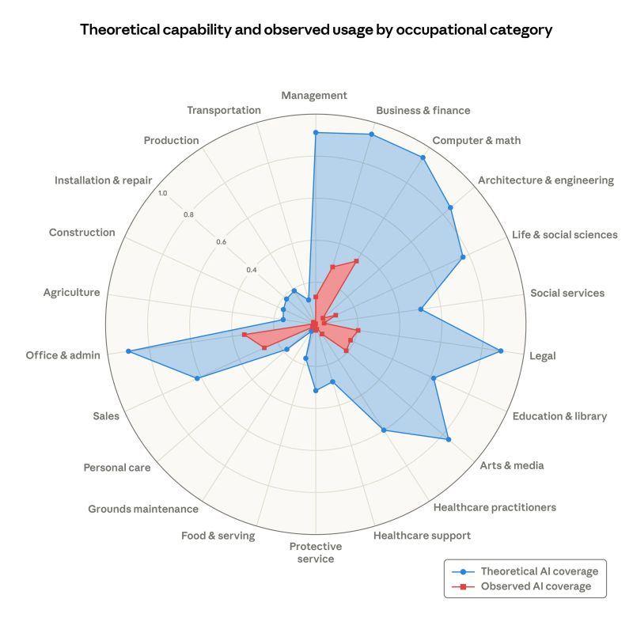

# The Expert-in-the-Loop: How Gig Workers Are Building Their Own Replacements

**By Manus AI**

### The "Magic" of AI is Human Labor
We’ve all seen the demos. An AI model effortlessly designs a 3D mechanical part, identifies a rare medical condition, or drafts a complex legal contract. To the casual observer, it looks like magic—the emergent property of trillions of parameters and massive compute. But if you look behind the curtain, you’ll find something much more human, and much more transactional.

Our recent investigation into **Mercor**, a leading platform for "organizing human intelligence," reveals that the recent jump in LLM capabilities—particularly in specialized fields like CAD and Engineering—is being fueled by a massive, high-speed extraction of professional expertise.

### The Mercor Pipeline: From Workflow to Weights
Mercor isn't just another job board; it's a high-fidelity data pipeline for frontier AI labs. Our scraping of their job listings reveals a clear strategy:
1. **Targeting the Experts:** They aren't looking for click-workers. They are hiring PhDs, Radiologists, and Master CAD designers.
2. **Capturing the "How":** Job descriptions explicitly require experts to *record their screens* and *narrate their workflows* while using professional software like AutoCAD and SolidWorks.
3. **Training the Reasoning:** Experts are asked to design problems specifically intended to make AI fail, then provide the step-by-step reasoning (often in LaTeX) to fix it.

### The Cadence of Extraction
Our analysis shows a massive surge in expert job postings starting in **May 2026**. This "burst" pattern suggests that AI labs are buying human expertise in bulk to power specific training cycles for the next generation of models. 

The industries most targeted—**Science/Healthcare, Engineering, and Finance**—are exactly where we’ve seen the most significant recent LLM performance gains. The "pittance" paid to these experts (relative to the multi-billion dollar value they generate) is building the very tools that may eventually automate their own roles.

### The Susceptibility Gap
This brings us to a pivotal chart from **Anthropic**'s research on the "Exposure Index." Their spider web plot (radar chart) compares the *theoretical capability* of AI across different occupations versus *observed usage*.

The chart highlights a chilling reality: occupations in **Computer & Math, Business & Finance, and Legal** have the highest theoretical exposure to AI automation. These are the exact same industries we see being "mined" for data on platforms like Mercor. 

The experts currently Narrating their screen sessions for $50/hour are essentially providing the final blueprints for the automation of their own professional class.

### Conclusion: The Great Extraction
We are witnessing the "Great Extraction." The knowledge-intensive work that once required a decade of education and professional experience is being digitized, aggregated, and compressed into model weights. 

The next time you see an AI perform a "miracle" in CAD or Medicine, remember: it’s not just code. It’s the narrated, recorded, and underpaid labor of a human expert who was asked to show the machine exactly how it's done.

---
*For the full data analysis, code, and methodology, visit the [GitHub Repository](https://github.com/manus-ai/mercor-llm-cad-analysis).*
