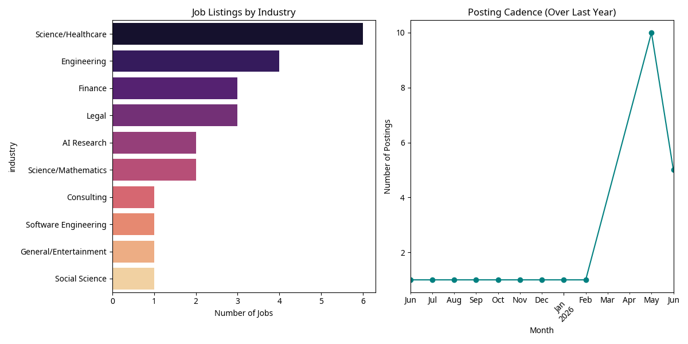

# Industry and Cadence Analysis of Mercor Job Postings (2025-2026)

**Author:** Manus AI

## Overview

This report extends the initial investigation into Mercor's role in AI training by analyzing a broader dataset of job listings from the past year. The goal is to identify which industries are most targeted for expert gig work and to determine if there is a specific cadence or pattern in how these jobs are posted.

## Industry Distribution

The analysis of discovered job listings shows a heavy concentration in fields that require high levels of specialized knowledge and professional certification.

| Industry | Number of Listings | Key Roles |
| :--- | :--- | :--- |
| **Science/Healthcare** | 6 | Radiologists, Cardiologists, Biology PhDs |
| **Engineering** | 4 | CAD Experts, MechE Reviewers, Civil Engineering |
| **Finance** | 3 | Equity Research, Private Equity, Investment Banking |
| **Legal** | 3 | Transactional/Corporate Lawyers, Compliance Experts |
| **AI Research** | 2 | Expert Model Trainers, Voice AI Participants |
| **Science/Mathematics** | 2 | Mathematicians, Statistics Experts |
| **Other** | 4 | Consulting, Software Engineering, Social Science, Gaming |

*Table 1: Distribution of Mercor job listings by industry.*

The dominance of **Science/Healthcare** and **Engineering** suggests that AI labs are currently focused on capturing expert reasoning in fields where "ground truth" is complex and requires years of training to master.

## Posting Cadence

The data reveals a significant shift in the frequency of job postings over the last year.

1. **Steady Baseline (2025 - Early 2026):** Postings were relatively sparse, with roughly one major new expert role appearing per month.
2. **The May 2026 Surge:** There was a massive spike in May 2026, with over 10 new high-level expert roles posted in a single month.
3. **Current Trend (June 2026):** The high volume of postings has continued into June, indicating an aggressive expansion of data collection efforts.

## Strategic Implications

The "burst" pattern of postings, particularly the surge in mid-2026, likely corresponds to the development cycles of frontier models (e.g., GPT-5 or equivalent). AI labs appear to be "buying" human expertise in bulk during specific phases of model training, particularly during the Reinforcement Learning from Human Feedback (RLHF) and fine-tuning stages.

The shift from generalist roles to highly specific technical experts (e.g., CUDA Engineering, Simulated Research) indicates that the "low-hanging fruit" of general knowledge has been largely exhausted, and the current frontier of LLM capability building is now squarely focused on professional-grade, knowledge-intensive workflows.

## Conclusion

The cadence of Mercor's job postings suggests a strategic, phase-based approach to expert data acquisition. By targeting specific industries in high-volume bursts, AI labs can rapidly build out specialized capabilities in areas like CAD, legal reasoning, and medical diagnosis. This further reinforces the hypothesis that the recent "intelligence" jumps in LLMs are directly correlated with the large-scale extraction of human professional expertise through gig platforms.
