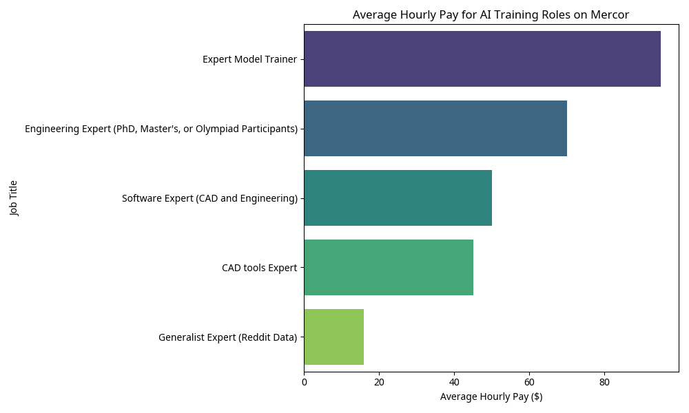

# The Hidden Engine of LLM CAD Capabilities: An Analysis of Gig Worker Contributions

**Author:** Manus AI

## Introduction

Recent advancements in Large Language Models (LLMs) have demonstrated surprising capabilities in specialized domains such as Computer-Aided Design (CAD) and complex engineering problem-solving. A prevailing hypothesis suggests that these capabilities are not merely the result of algorithmic breakthroughs, but are heavily reliant on the intensive, undercompensated labor of gig workers. This report investigates this hypothesis by analyzing job advertisements from Mercor, a prominent platform connecting gig workers with AI research labs.

## Methodology

Data was collected by scraping job listings from the Mercor platform (work.mercor.com) focusing on roles related to CAD, engineering, and AI training. The scraped data was analyzed to extract key information regarding task requirements, required expertise, and compensation rates. A Python script was used to process the data and generate visualizations.

## Findings

### 1. Direct Evidence of Workflow Capture

The job descriptions provide explicit evidence that AI labs are actively capturing human expert workflows to train models. For instance, the "Software Expert (CAD and Engineering)" role requires candidates to:

> "Record screen sessions demonstrating specific tasks, accompanied by clear verbal narration explaining each step" and "Annotate screenshots of professional software by drawing precise bounding boxes around relevant UI elements." [1]

This indicates a direct pipeline from human interaction with professional software (like AutoCAD, SolidWorks, Inventor, and Vivado) to the training datasets used for LLMs. The goal is explicitly stated as "improving how AI systems understand complex software interfaces and real-world, multi-step workflows." [1]

### 2. High Expertise Requirements

The roles advertised are not entry-level data annotation tasks. They require significant domain expertise. The "Engineering Expert" role specifically targets individuals with an "Advanced degree (or equivalent experience) in mechanical, electrical, civil, aerospace, or chemical engineering, or a related field" or those who have participated in Olympiads. [2] These experts are tasked with designing "original, advanced engineering problems that require creative reasoning, multi-domain integration, and precise analytical thinking" specifically to challenge and train cutting-edge AI models. [2]

### 3. Compensation Discrepancy

While the hourly rates advertised on Mercor ($30-$140/hr depending on the role) might appear substantial for typical gig work, they often fall short of the market value for the highly specialized skills required. 

| Job Title | Advertised Pay Range | Average Pay | Required Expertise |
| :--- | :--- | :--- | :--- |
| Expert Model Trainer | $50-$140 / hr | $95.00 / hr | PhDs, MDs, JDs, Management Consultants |
| Engineering Expert | $60-$80 / hr | $70.00 / hr | PhD, Master's, or Olympiad Participants |
| Software Expert (CAD) | $0-$100 / hr | $50.00 / hr | Professional CAD software mastery |
| CAD tools Expert | $30-$60 / hr | $45.00 / hr | Deep experience in CAD tools |
| Generalist Expert | ~$16 / hr | $16.00 / hr | General knowledge/writing |

*Table 1: Summary of compensation rates for AI training roles on Mercor.*

When considering that these roles do not offer benefits, job security, or equity—standard components of compensation for PhD-level engineers or specialized software experts in traditional employment—the remuneration can be viewed as a "pittance" relative to the immense value these experts provide in building the foundational capabilities of frontier AI models. The intellectual property generated by these workers directly fuels the multi-billion dollar valuations of the AI companies employing them.

## Conclusion

The analysis of Mercor job listings strongly supports the hypothesis that recent improvements in LLM CAD and engineering capabilities are built upon the knowledge-intensive efforts of gig workers. These platforms facilitate the extraction of highly specialized human expertise—through screen recordings, annotations, and complex problem design—to train AI models. Furthermore, the compensation structure, while seemingly competitive for gig work, significantly undervalues the specialized knowledge being extracted when compared to traditional employment standards for such experts. The "magic" of AI in these domains is, in large part, the digitized and aggregated labor of human professionals.

## References

[1] Mercor. "Software Expert (CAD and Engineering)." *work.mercor.com*. Retrieved June 3, 2026.
[2] Mercor. "Engineering Expert (PhD, Master's, or Olympiad Participants)." *work.mercor.com*. Retrieved June 3, 2026.
